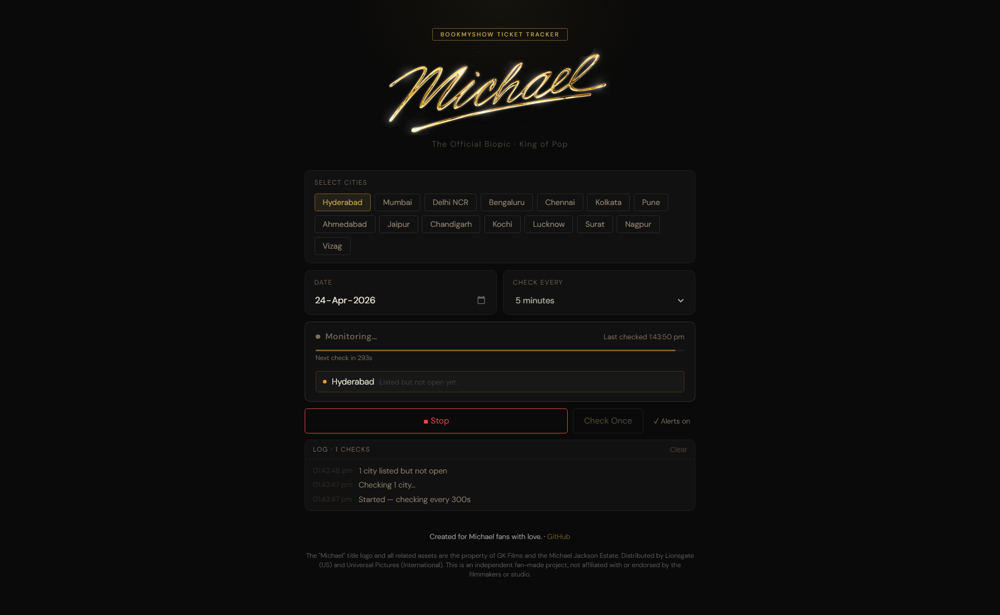
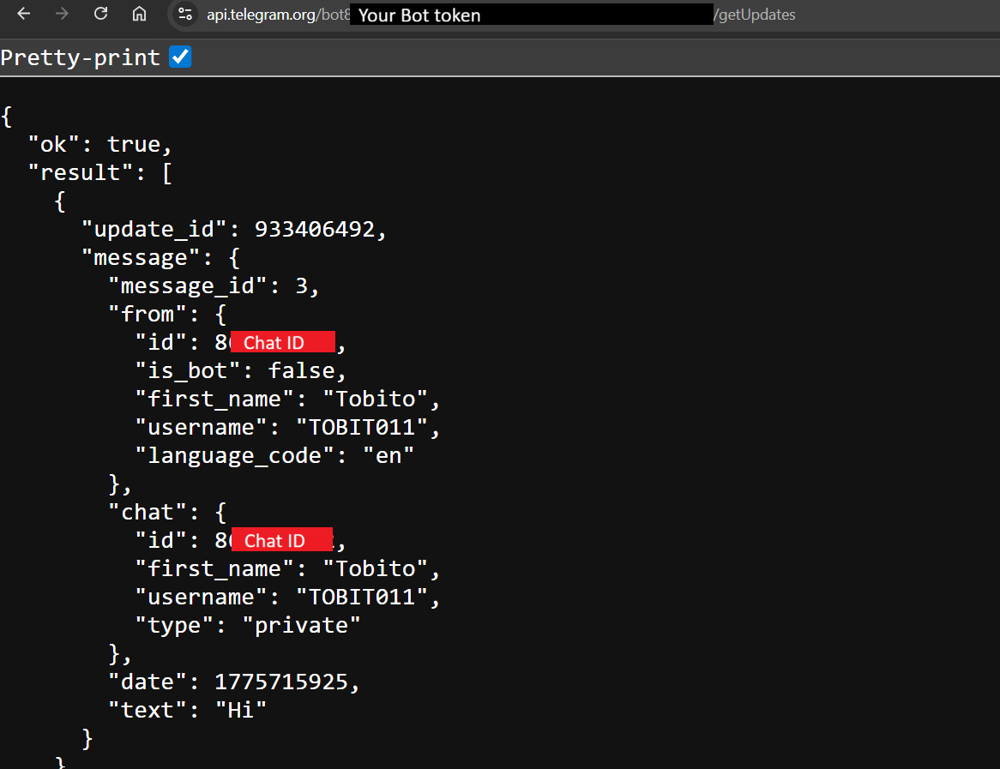
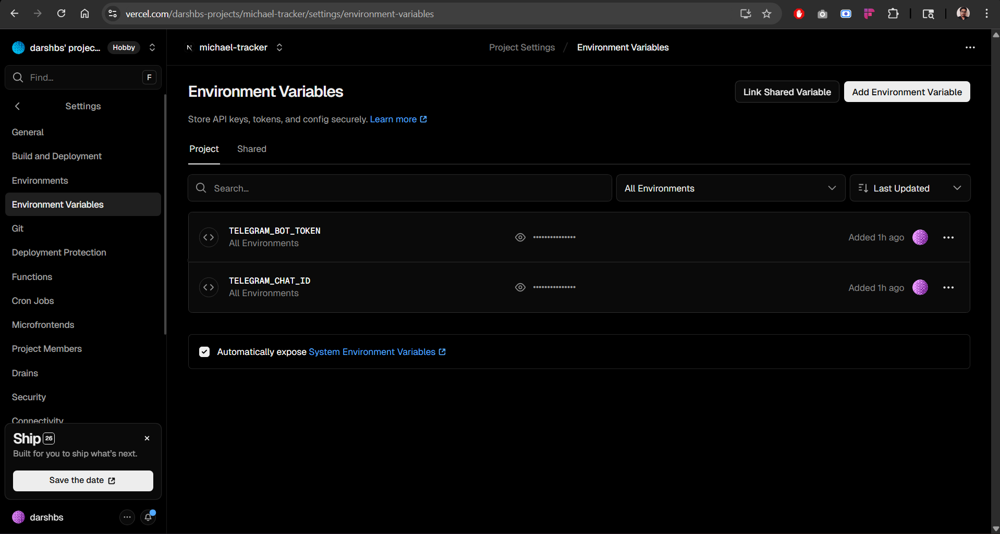
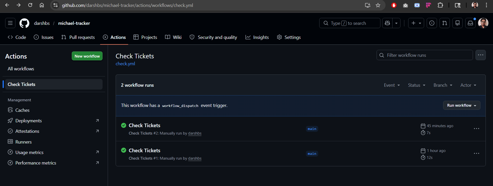
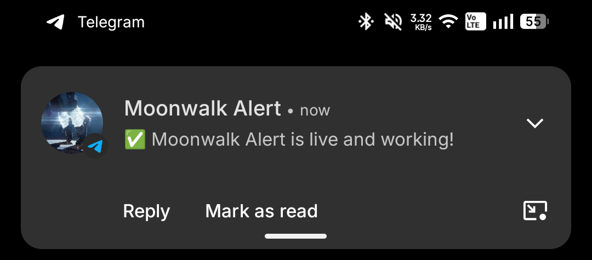
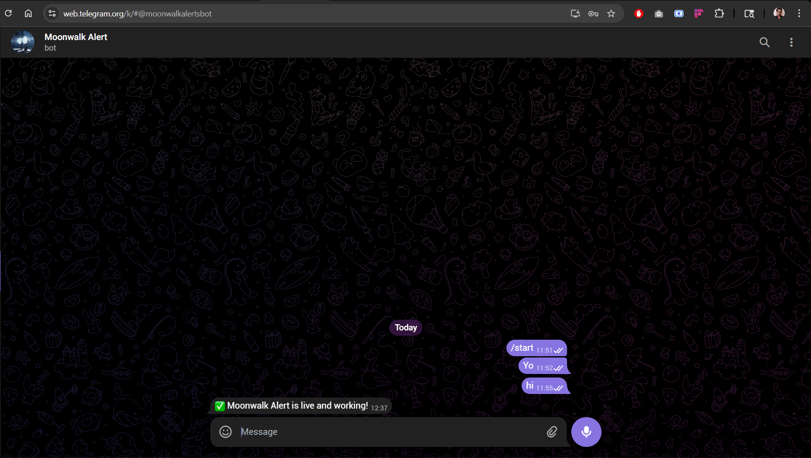

# 🎬 Michael Tracker


A Next.js app that monitors BookMyShow and sends you a **Telegram notification the moment tickets go live** for the Michael Jackson biopic *Michael (2026)* — across any city, any theatre.

Live at → **[michael-tracker.vercel.app](https://michael-tracker.vercel.app)**

---

## What it does

- Checks BookMyShow every 5 minutes automatically (via GitHub Actions)
- Monitors multiple cities simultaneously
- Sends a Telegram message the instant tickets go live
- No need to keep any tab open — runs entirely in the background

A couple of honest catch:

- The live site works only while you have the tab open. The background automation is tied to my own setup.
- The Telegram notification is hardcoded to my personal bot, so it only alerts me.
- I'm also planning to expand this so more users can directly set up notifications without having to manually configure their own bot, will build it out if this whole thing actually works when tickets go live

But if you want to set up your own version with your own bot, all the instructions are in this README, it takes about 10-15 minutes.

---

## How it works

```
GitHub Actions (every 5 min)
        ↓
/api/check  ↔  fetches BookMyShow for selected cities
        ↓                       ↑
tickets found? → no → check again in 5 mins (repeat)
        ↓ yes
/api/notify  →  Telegram message on your phone
```

---

## Tech stack

- **Next.js** — frontend + serverless API routes
- **Vercel** — hosting and deployment
- **GitHub Actions** — cron scheduler (every 5 min, free)
- **Telegram Bot API** — push notifications

---

## Project structure

```
michael-tracker/
├── pages/
│   ├── index.js          # Main UI
│   └── api/
│       ├── check.js      # Fetches BMS, parses venue/showtime data
│       └── notify.js     # Sends Telegram message
├── lib/
│   └── cities.js         # List of supported BMS cities
├── styles/
│   └── globals.css
├── .github/
│   └── workflows/
│       └── check.yml     # GitHub Actions cron job
├── vercel.json
└── package.json
```

---

## Setup & deployment

### 1. Clone and deploy

```bash
git clone https://github.com/darshbs/michael-tracker
cd michael-tracker
npm install
```

Push to GitHub → import on [vercel.com](https://vercel.com) → deploy.

Once deployed, you'll see the landing page:


 
---

### 2. Create a Telegram bot

1. Open Telegram → search `@BotFather` → `/newbot`
2. Give it a name → copy the **token** it gives you
3. Message your new bot (send anything)
4. Visit `https://api.telegram.org/bot<TOKEN>/getUpdates`
5. Copy your `chat_id` from the response



---

### 3. Add environment variables on Vercel

In your Vercel project → Settings → Environment Variables:

| Key | Value |
|-----|-------|
| `TELEGRAM_BOT_TOKEN` | your bot token from BotFather |
| `TELEGRAM_CHAT_ID` | your chat ID from getUpdates |



---

### 4. Set up GitHub Actions cron

The file `.github/workflows/check.yml` is already in the repo. It runs every 5 minutes and pings your Vercel API automatically — no extra setup needed.

To test manually: GitHub repo → **Actions** tab → **Check Tickets** → **Run workflow**



---

### 5. Test Telegram

Visit this URL after deploying:

```
https://[your-app-name].vercel.app/api/notify
```

You should receive a message from your bot confirming everything works.





---

## BMS URL pattern

The app uses BookMyShow's URL structure discovered from live movies:

```
https://in.bookmyshow.com/movies/{city-slug}/{movie-slug}/buytickets/{event-code}/{date}
```

Example (Project Hail Mary):
```
https://in.bookmyshow.com/movies/hyderabad/project-hail-mary/buytickets/ET00451760/20260408
```

Michael (2026) event code: `ET00470110`

---

## Supported cities

Hyderabad, Mumbai, Delhi NCR, Bengaluru, Chennai, Kolkata, Pune, Ahmedabad, Jaipur, Chandigarh, Kochi, Lucknow, Surat, Nagpur, Vizag

---

## Notes

- Vercel Hobby plan cron jobs are limited to once/day — GitHub Actions handles the every-5-min scheduling instead
- The `/api/check` route tries the BMS mobile JSON API first, falls back to HTML scraping
- Tickets for Michael (2026) are expected to open around **April 17–19, 2026**

---

Created by Darshan - GitHub: [darshbs](https://github.com/darshbs)

Created for Michael fans with love. 🎤

---

**Disclaimer:** The "Michael" title logo and all related assets are the property of GK Films and the Michael Jackson Estate. Distributed by Lionsgate (US) and Universal Pictures (International). 

This is an independent fan-made project, not affiliated with or endorsed by the filmmakers or studio.


